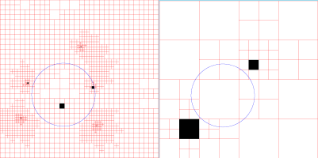

em { color: green; }

# subdiv-core
Interval Newton operator to detect root containing regions for complex polynomials via subdivision using interval arithmetics and outward rounding to error-control.

Implementation based on:

N. Kamath  
"Subdivision Algorithms for Complex Root Isolation: Empirical Comparisons"

### Disclaimer

Although I tried my best to ensure correctness of the implementation and therefore the results,
the code comes with no warranty.

### (1) Use and examples

The software reads in a provided text file with the coefficients of the (at most degree-10) polynomial, computes
regions of definite roots if found and outputs a list of _exact rational box coordinates where definitely roots lie within_ into the log text file `_subdiv-core.log`.

Additionally an image in `_roots.bmp` is created that shows an overview of the subdivision process. The unit circle is drawn in blue,
definite root containing pixels are black, definitely no root containing are white, gray are undecided and red lines
indicate the size at which a box has been discarded.

All floating point operations are performed in interval arithmetics with outward rounding - except for reading values from file and printing.

#### Examples

Polynomial `z^2-2*i=0`

subdiv-core file=_z2.txt range=-2,3,-2,3 depth=32 

(Note: Using range=-2,2,-2,2 does not find the roots here as they lie on grid lines in this starting box (see limitations)).

`degree-6 polynomial`

subdiv-core file=_p5.txt range=-2,3,-2,3 depth=32 

### (2) Command-line parameters

`RANGE=x0,x1,y0,y1`

The position of the initial box in the complex plane. Numbers provided are read in as double precision. The range may or may not encompass all roots depending on the region of interest to analyze.

`DEPTH=N`

The maximum subdivision depth. If not provided, the value 16 is used.

`STOP=string`

This determines how to treat boxes that can be judged to definitely containing a root. Standard behaviour is: putting such a box
into the output list and not subdivide further.

    STOP=DEEPEST

Subdivides root containing boxes until the deepest level provided by parameter `DEPTH` is reached.

    STOP=WIDTH,w

Subdivides root-containing boxes as long as their width is larger than `w` in both directions (`w` being read in as double, see limitations). 

`FILE=name`

The input text file of the coefficients of the polynomial. If not provided, the file `_infkt.txt` will be loaded. The file consists of several lines, each describing one coefficient. It must end with a decimal point.

Coefficients can be provided in a floating point or rational number format and as single complex values or as complex
intervals.

     Rn,a,b
 
 denotes a floating point coefficient for the degree `n` term (see limitations), describing the complex number `a+b*i`. `n` is being read in as int32_t, a,b as double.

     Rn,a0,a1,b0,b1
 
 denotes a floating point coefficient for the complex interval [a0..a1]+i*[b0..b1] where `a0,a1,b0,b1` are read in as double.

     Dn,q,a,b
 
  denotes a rational coefficient for the degree `n` term. `q,a,b` are read in as <b>int64_t</b> and describe the complex number a/q+i*b/q. Division is performed in double precision using constant upward rounding but without error-control (see limitations).

     Dn,q,a0,a1,b0,b1
 
 denotes a complex interval [a0/q..a1/q]+i*[b0/q..b1/q]. It is not checked whether a0 <= 
    a1 or b0 <= b1.

### (3) Short code description

The software uses my custom made interval library custInt (file `_custInt_local.cpp`) with C++ double precision as end points and extension to
complex intervals and 2x2 interval matrices. It relies on constant
upward rounding (struct `CustRoundingUpwards`).

The main function is `find_roots`.

The output image has a constant size of 1024 x 1024 (variale `SCREENWIDTH`).

The subdivision stops at an empirical choice of 2^16 boxes at most concurrently in the process queue (variable `MAXBOXES`). Boxes that are already identified as definitely containing a root are still valid and printed out.

## (4) Limitations

- Floating point numbers read in are treated as double and converted to an internal representation by the C++ function sscanf. It is
at the discretion of the user to only provide accurately representable numbers if exactness is demanded for the purpose at hand, e.g. `0.1` cannot be represented but may not be of importance if e.g. it denotes a range value that is much larger than the region to analyze. 

- Integer values read-in
are treated as int32_t (coefficient position, maximal subdivision depth) or int64_t (coefficient value) depending on its use. 

- The `D=q,a,b` input file line
e.g. invokes a double precision division a/q and are subject to the set rounding mode (constant upward). If q is a power of 2, the division is rounding-free as by floating point standard.

- The image should not be taken as exact as conversion from box coordinates to screen coordinates
is not done in an error-controlled manner. It merely serves as a visual guide as to how the subdivision proceeded.

- As subdivision is done in a 2x2 manner from the x/y midpoint of a box, roots that lie on a positive or negative power-of-2 gridline 2^n - in particular 0 - 
might not be found. In that case it is recommended enlarging the `RANGE` parameter, e.g from -2,2,-2,2 to -2,3,-2,3 or similar.

- Box width computation does not demand error-controlled calculation as it is merely a "return now or later" decision and not one
affecting whether a root is found or not. Box widths very close to the provided threshold at `STOP=WIDTH,w` may or may not lead to further subdivision depending on rounding effect.

### (4) Further information

Background on the implementation can be found here

http:https://fractalforums.org/fractal-mathematics-and-new-theories/28/root-finding-via-subdivisionia/3658/msg23217#new

### (5) Contact

Please direct any comments to:

marcm200@freenet.de

Marc Meidlinger, July-August 2020

